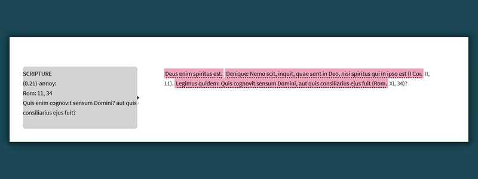

# Install

```python
pip install vulgata-spacy
```

# About

Vulgata spaCy is a library built upon [spaCy](www.spacy.io) to automate the identification and extraction of potential Biblical quotes in medieval Latin texts. The main pipeline leverages [Bloom embeddings](https://explosion.ai/blog/bloom-embeddings) which were trained on the entire Patrologia Latina (PL) after substantial cleaning. The PL text was left unlemmatized. Unfortunately, the data licensing prevents its distribution. These bloom embeddings were loaded into a spaCy pipeline as floret embeddings. This allows for the pipeline to be quite small, while still being able to capture deep semantic and syntactic meaning.

The pipeline contains several different components. First, the pipeline contains an EntityRuler whose patterns can identify direct quotation or partial quotation of Scripture with or without punctuation marks.

A second component is a quote detection machine learning model that is designed to identify quotes within context. Quotation marks and other indicators were removed before training so that the model would learn the features and context of Latin quotations.

Both of these components flag potential or likely Scriptural quotes. But being able to detect a Scriptural reference is, however, only part of the challenge. The second step in this process is linking that quote to a specific verse of the Vulgate. This problem is not as straightforward as it might appear and is compounded in several ways. First, Latin texts do not have standard spelling (even across modern editions); second, modern Latin texts do not agree on punctuation; third, many version of the Bible circulated in the Middle Ages that did not conform to the standard Vulgate, meaning words could appear out of order or synonyms used. These variant readings are often collectively known as Vetus Latina material. Therefore, matching "in initio fect Deus terras et caelum" to Genesis 1:1 ("in principio creavit Deus terram et caelum") is not as simple as fuzzy-string matching. In order to correctly link data, semantic and syntactic meaning must be retained.

To overcome this, Vulgata SpaCy contains the entire Vulgate as raw text, cleaned text, and partial text. These were embedded with the pipeline's vectors. An annoy index was then created. The pipeline allows for users to create their own index and query it with a new text.


# Usage

```python
#import vulgata-spacy
from vulgata_spacy import vulgata_spacy

nlp = vulgata_spacy.VulgataSpaCy()
doc = nlp.create_doc("Deus enim spiritus est. Denique: Nemo scit, inquit, quae sunt in Deo, nisi spiritus qui in ipso est (I Cor. II, 11). Legimus quidem: Quis cognovit sensum Domini, aut quis consiliarius ejus fuit (Rom. XI, 34)?")

doc = nlp.annoy_matcher(style="sent", max_distance=.50)

for ent in doc.ents:
    print(ent.text)
    if ent._.scripture != True:
        for scripture in ent._.scripture:
            print(scripture)
        print()
```
## Expected Output

```
Deus enim spiritus est.
{'score': 0.25021496415138245, 'book': '3Rg', 'chapter': 18, 'verse': 27, 'latin': 'Cumque esset jam meridies, illudebat illis Elias, dicens: Clamate voce majore: deus enim est, et forsitan loquitur, aut in diversorio est, aut in itinere, aut certe dormit, ut excitetur.', 'matcher': 'annoy'}

Denique: Nemo scit, inquit, quae sunt in Deo, nisi spiritus qui in ipso est (I Cor.
{'score': 0.38035616278648376, 'book': '1Cor', 'chapter': 2, 'verse': 11, 'latin': 'Quis enim hominum scit quae sunt hominis, nisi spiritus hominis, qui in ipso est? ita et quae Dei sunt, nemo cognovit, nisi Spiritus Dei.', 'matcher': 'annoy'}

Legimus quidem: Quis cognovit sensum Domini, aut quis consiliarius ejus fuit (Rom.
{'score': 0.20919208228588104, 'book': 'Rom', 'chapter': 11, 'verse': 34, 'latin': 'Quis enim cognovit sensum Domini? aut quis consiliarius ejus fuit?', 'matcher': 'annoy'}
```

# Visualize the Document in Streamlit
```python
import streamlit as st
from vulgata_spacy import vulgata_spacy

nlp = vulgata_spacy.VulgataSpaCy()
doc = nlp.create_doc("Deus enim spiritus est. Denique: Nemo scit, inquit, quae sunt in Deo, nisi spiritus qui in ipso est (I Cor. II, 11). Legimus quidem: Quis cognovit sensum Domini, aut quis consiliarius ejus fuit (Rom. XI, 34)?")
doc = nlp.annoy_matcher(style="sent", max_distance=.50)
nlp.visualize_doc()
```

Once created, run the following command in your CLI

```
streamlit run [file]
```

## Expected Output

